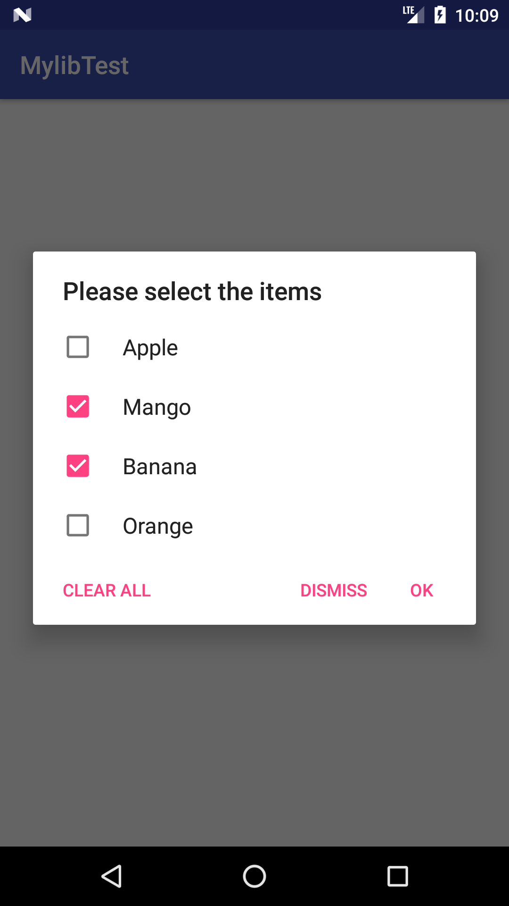
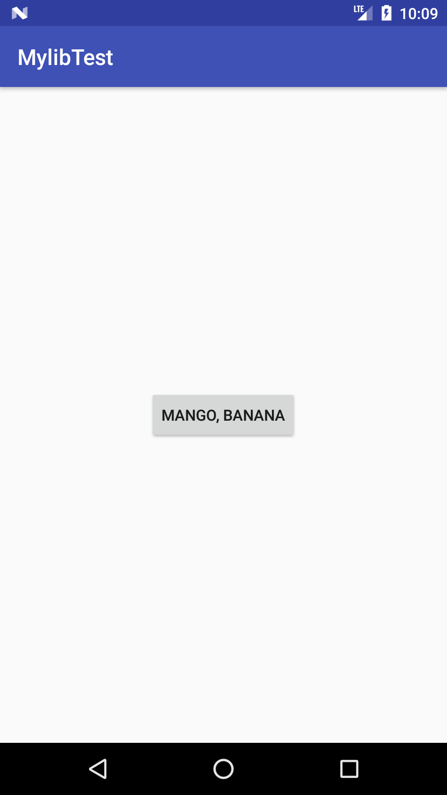

# PrintArray
Android Library for Printing arrays in AlertDialog interface with checkbox.

## How to:

To get a Git project into your build:

### Step 1. Add the JitPack repository to your build file
Add it in your root build.gradle at the end of repositories:

	allprojects {
		repositories {
			...
			maven { url 'https://jitpack.io' }
		}
	}
  
  

### Step 2. Add the dependency

	dependencies {
		implementation 'com.github.Tobibur:PrintArray:v1.1.0'
	}

## Usage:

### 1. Set title of the Dialog Box (Optional)

```Java
PrintArray.setBoxTitle("Your String here for title");
```

### 2. Call this method below Onclick of a button :

```Java
PrintArray.diaBox(Button symp, String[] listItems, Context context)
```

## Sreenshots:

 
 


[](https://jitpack.io/#Tobibur/PrintArray)
