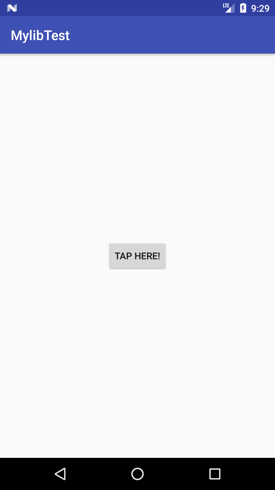
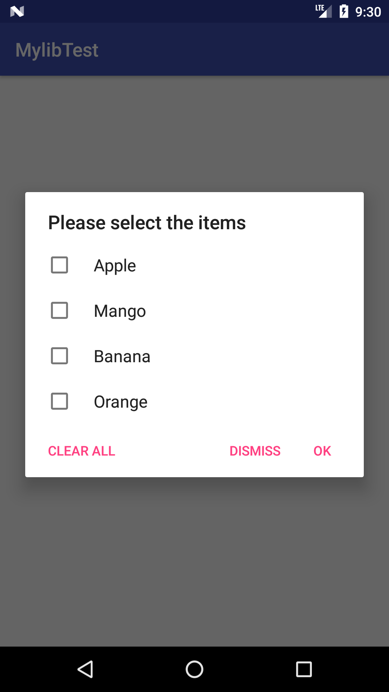

# PrintArray
Android Library for Printing arrays in AlertDialog interface with checkbox.

How to:

To get a Git project into your build:
Step 1. Add the JitPack repository to your build file
Add it in your root build.gradle at the end of repositories:

	allprojects {
		repositories {
			...
			maven { url 'https://jitpack.io' }
		}
	}
  
  

Step 2. Add the dependency

	dependencies {
		implementation 'com.github.Tobibur:PrintArray:v1.0.1'
	}

Usage:

Call this method below Onclick of a button :

```Java
PrintArray.diafunction(Button symp, String[] listItems, Context context)
```

Sreenshots:

 


To get the Ids of the items selected, call the method given below:

```Java
String ids = PrintArray.getSelectedItemsId();
```


[](https://jitpack.io/#Tobibur/PrintArray)

[](https://jitpack.io/#Tobibur/PrintArray)
